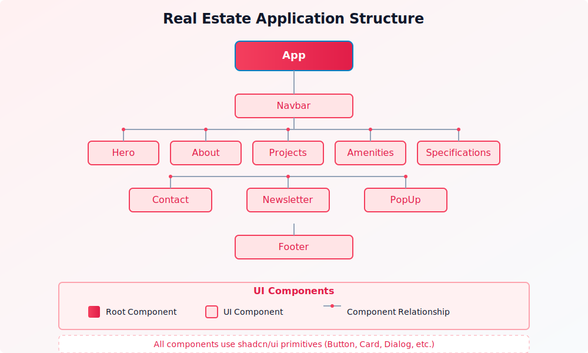

# Estate - Modern Real Estate Website

A sleek, responsive real estate website built with modern web technologies. The site showcases property listings, amenities, specifications, and provides multiple ways for potential clients to get in touch.

## Tech Stack

The application is built using a modern frontend tech stack:

-   **React 19** - UI library for building component-based interfaces
-   **TypeScript** - For type-safe code and better developer experience
-   **Vite** - Next-generation frontend build tool for faster development and optimized production builds
-   **Tailwind CSS** - Utility-first CSS framework for rapid UI development
-   **Framer Motion** - Animation library for creating fluid UI transitions and interactions
-   **shadcn/ui** - Accessible and customizable UI components built on Radix UI primitives
-   **Embla Carousel** - Lightweight carousel component for image galleries and content sliders

## Project Structure

The application follows a component-based architecture with a clean separation of concerns:

### Core Components

-   **Layout Components** - `Navbar`, `Footer` for consistent site structure
-   **Home Sections** - `Hero`, `About`, `Projects`, `Amenities`, `ProjectSpecifications`, `Contact`, `Newsletter`
-   **UI Components** - Reusable UI elements from shadcn/ui customized for the application's design system

### Features

-   Responsive design that works on all device sizes
-   Smooth scroll navigation between sections
-   Interactive UI elements with hover animations
-   Contact form for lead generation
-   Strategically timed popup component for improved conversion
-   Image carousels for property and amenity showcases

## Design System

The application uses a consistent design system with:

-   Custom color palette based on sky/blue gradients
-   Typography using the Inter font family
-   Component variants for buttons, cards, and other UI elements
-   Custom animations for enhanced user experience

## Utilities

-   `scrollUtils.ts` - Helper functions for smooth scrolling behavior
-   `imageImports.ts` - Centralized image import management

## Performance Considerations

-   The application uses code splitting to optimize initial load times
-   Images are optimized and served in modern formats (webp)
-   Animations are GPU-accelerated for smooth performance
-   CSS is modular and follows utility-first principles

## 🙏 Acknowledgements

Special thanks to my client for the opportunity to create this project and for the collaborative feedback throughout the development process.

---

## 👨‍💻 About the Developer

This project was built by Neil Lunavat with ❣️. Connect with me on [LinkedIn](https://www.linkedin.com/in/neil-lunavat).
